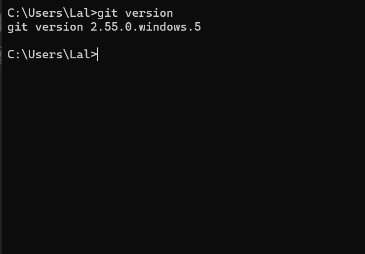
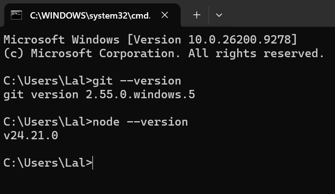
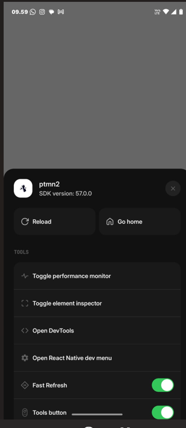
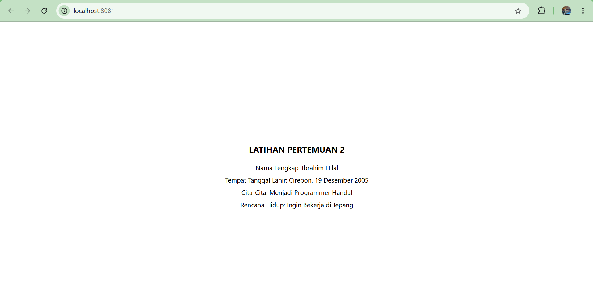

# **Praktikum Menyiapkan Memulai Pemrograman Mobile dengan React Native**
## **Tujuan Pembelajaran**
- Menginstal Git dan GitHub
- Menginstal Node.js dan NPM
- Menginstal Expo CLI
- Membuat project React Native
- Menjalankan Project React Native

1. **Install Git di Local**
   - Unduh dan install Git via: https://git-scm.com/install/windows
   - Verifikasi Git (Buka CMD/Terminal dan ketik `git --version`)
   
   

2. **Install Node.js**
   - Unduh dan install Node.js via: https://nodejs.org/en/download
   - Verifikasi Node.js (Buka CMD/Terminal dan ketik `node --version` dan `npm --version`)
   
   

3. **Memulai Projek dengan Framework Expo**
    - Buka terminal pada code editor
    - Pastikan aktif di repository yang dituju
    - ketikan (npm create-expo-app ptmn2 -- template blank)
    - tunggu hingga proses install selesai
    - projek selesai
    

4. Menjalankan Projek React Native
    - Masuk ke directory projek (cd ptmn2)
    - Jalankan projek (npx expo start)
    - Scan QR Code dengan Aplikasi Expo Go
    - jika ingin run emulator di WEB ketik w
    - di terminal "npx expo install react-dom react-native-web"
    - npx expo start --web

5. Latihan pertemuan -2
    - Tambahkan text berupa
    - Nama Lengkap
    - Tempat Tanggal Lahir
    - Cita-Cita
    - Rencana Hidup
    