# Laporan Praktikum Pemrograman Mobile Pertemuan 3

## Modul 3: Core Components, Styling & Interaktivitas Dasar

### Langkah 1: Mengimpor Components
Mengimpor seluruh 16 Core Components React Native yang dibutuhkan, seperti `SafeAreaView`, `View`, `Text`, `Image`, `ScrollView`, `FlatList`, `SectionList`, `TextInput`, `Button`, `TouchableOpacity`, `Switch`, `Modal`, `ActivityIndicator`, `StyleSheet`, `Alert`, serta `KeyboardAvoidingView` dan `Platform`.
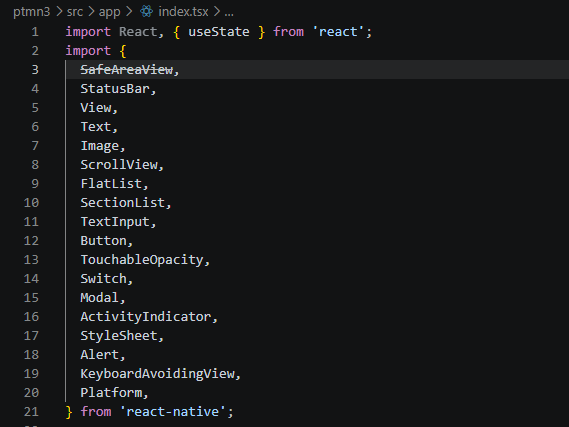

### Langkah 2: Menyiapkan Data Objek dan Array
Mendefinisikan data statis yang akan ditampilkan pada aplikasi CV Digital, meliputi data objek profil pribadi (`PROFILE_DATA`), array keahlian (`SKILLS_DATA`), serta data riwayat proyek dan pendidikan berbasis seksi (`HISTORY_DATA`).
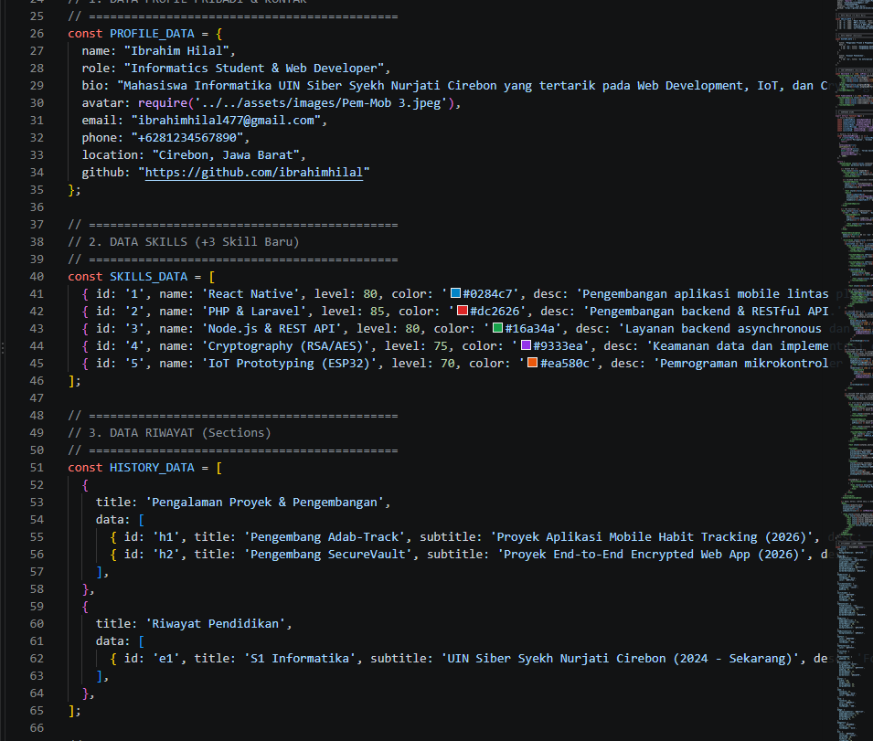

### Langkah 3: Membuat Sub-Components (SkillCard & TimelineCard)
Merancang sub-komponen terpisah agar kode lebih rapi dan modular, yaitu `SkillCard` untuk menampilkan nama serta bilah persentase keahlian, dan `TimelineCard` untuk menampilkan riwayat pengalaman.
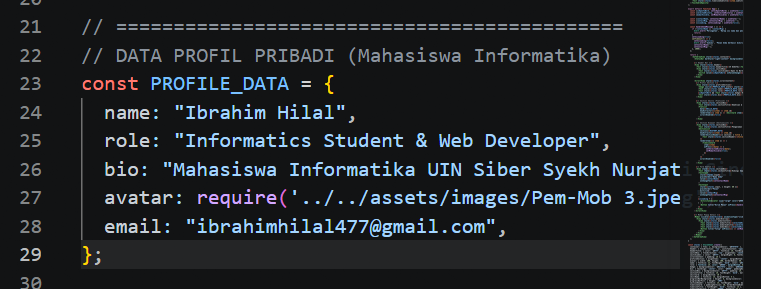

### Langkah 4: Menggunakan useState untuk State Management
Menginisialisasi state di dalam komponen utama `App`, antara lain `isOpenToWork` untuk status ketersediaan kerja, `selectedItem` untuk data modal, `modalVisible` untuk visibilitas pop-up, `contactName` & `contactMessage` untuk form input, `isLoading` untuk indikator proses, serta `activeTab` untuk filter navigasi.
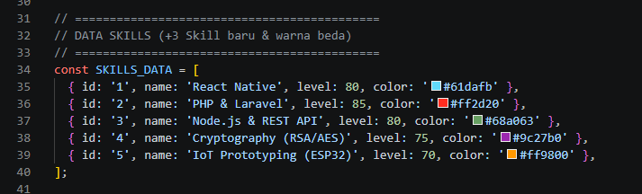

### Langkah 5: Membuat SafeAreaView, StatusBar, dan Header Bar
Menyusun tata letak paling atas aplikasi menggunakan `SafeAreaView` agar aman dari notch layar HP, `StatusBar` untuk warna bilah status, serta `Header Bar` yang dilengkapi komponen `Switch` untuk mengubah status `#OpenToWork`.
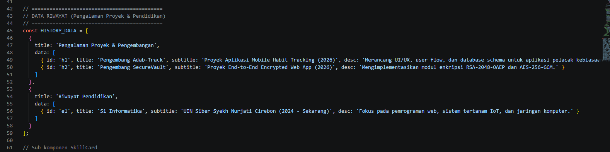

### Langkah 6: Menggunakan ScrollView dan Menampilkan Profil
Membungkus area utama dengan `ScrollView` dan `KeyboardAvoidingView` agar halaman dapat di-scroll dengan lancar, serta menampilkan kartu profil lengkap berisi foto avatar, nama, peran, deskripsi bio, dan tombol media sosial.
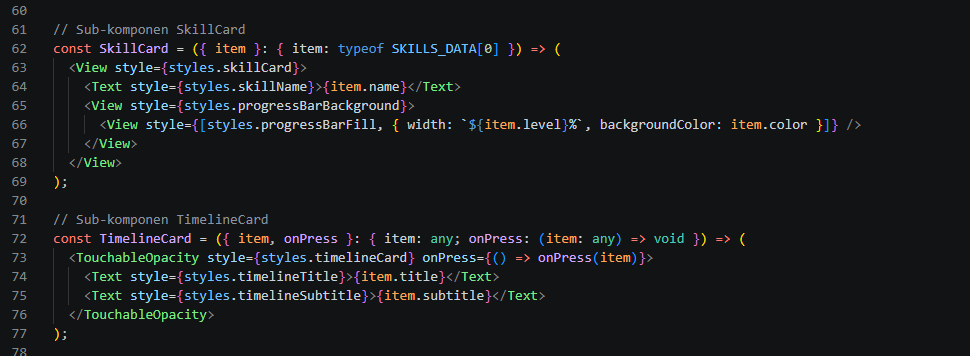

### Langkah 7: Menampilkan Daftar Skills dengan FlatList
Menampilkan daftar keahlian secara dinamis menggunakan komponen `FlatList` dengan merender sub-komponen `SkillCard` yang dapat diklik untuk melihat detail.
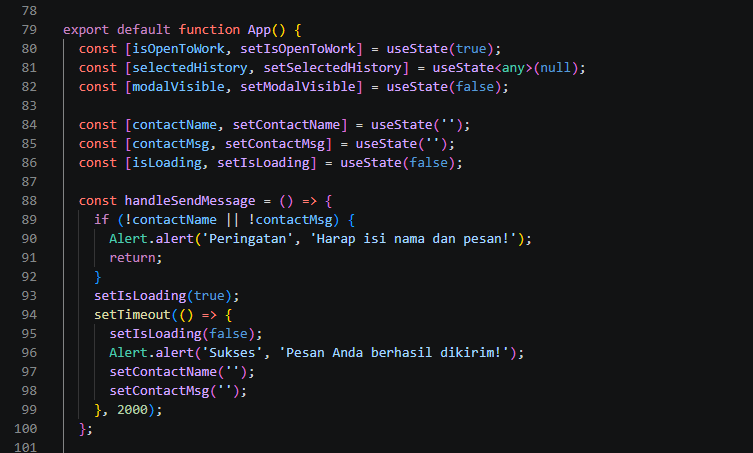

### Langkah 8: Menampilkan Riwayat dengan SectionList
Mengelompokkan data pengalaman proyek dan pendidikan ke dalam bagian (*sections*) menggunakan `SectionList` yang dipadukan dengan sub-komponen `TimelineCard`.
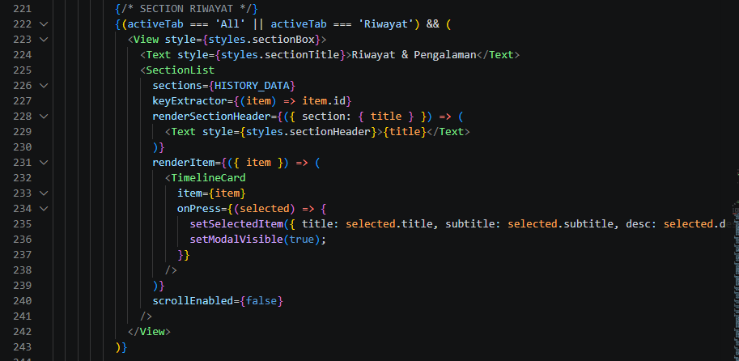

### Langkah 9: Membuat Form Kontak dengan TextInput, Button, dan ActivityIndicator
Membuat form interaktif untuk mengirim pesan yang menggunakan `TextInput` (input teks tunggal dan multiline), tombol `Button` untuk memicu aksi, serta `ActivityIndicator` untuk menampilkan animasi loading saat pesan dikirim.
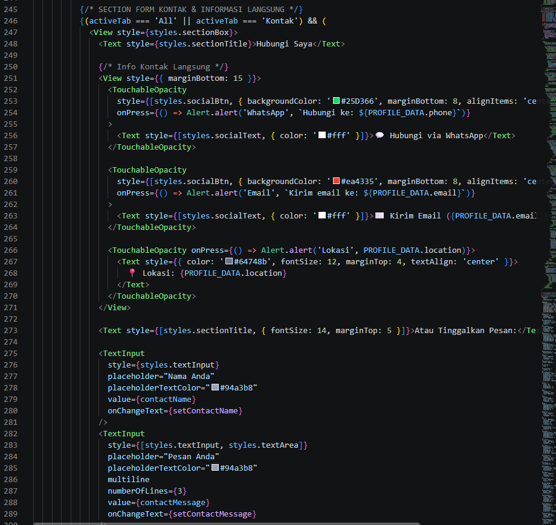

### Langkah 10: Menampilkan Detail Riwayat dengan Modal
Menyediakan dialog `Modal` interaktif yang akan muncul di atas layar untuk menampilkan detail lengkap saat pengguna menekan salah satu kartu keahlian atau riwayat pengalaman.
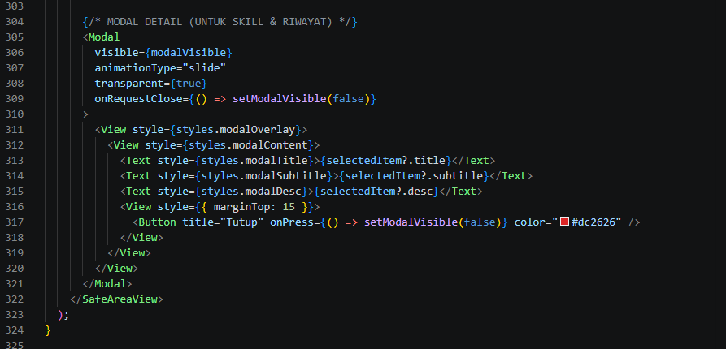

### Langkah 11: Menerapkan Styling Terpusat dengan StyleSheet
Mengatur seluruh gaya tampilan visual aplikasi (warna latar terang, tata letak Flexbox, margin, padding, serta font) secara terpusat menggunakan `StyleSheet.create()`.
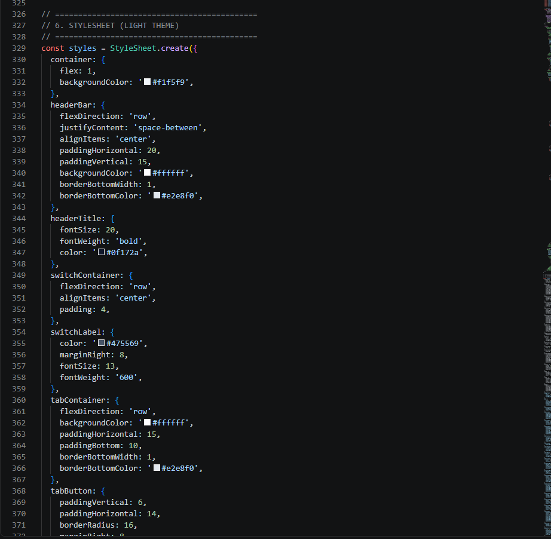

### Langkah 12: Pengujian dan Verifikasi Tampilan Aplikasi
Menjalankan aplikasi menggunakan perintah `npx expo start`, membuka tampilan pada web browser (Google Chrome), dan memastikan seluruh komponen serta tombol interaktif berjalan dengan baik tanpa kendala.

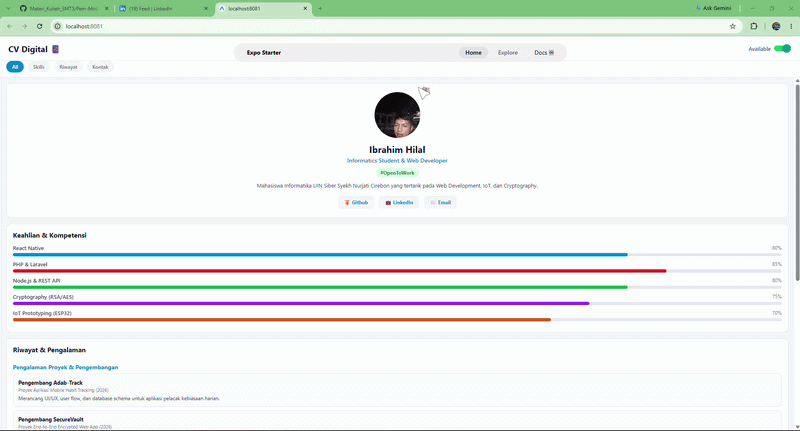