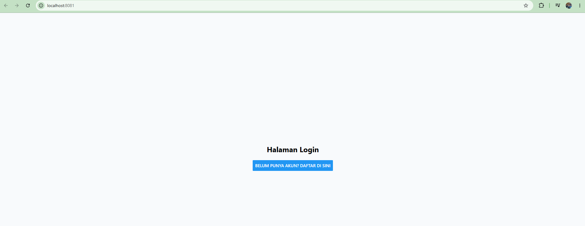
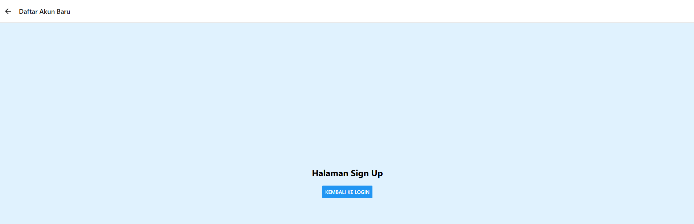
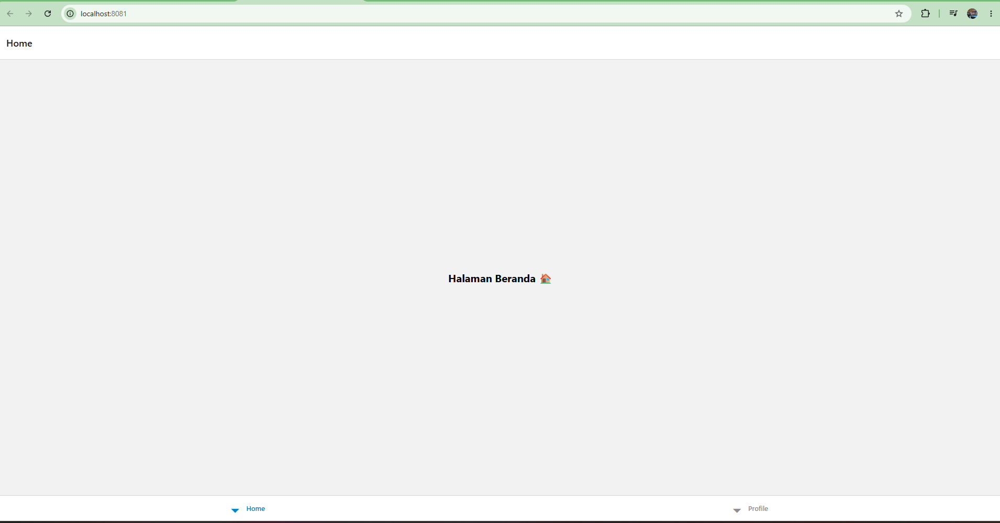
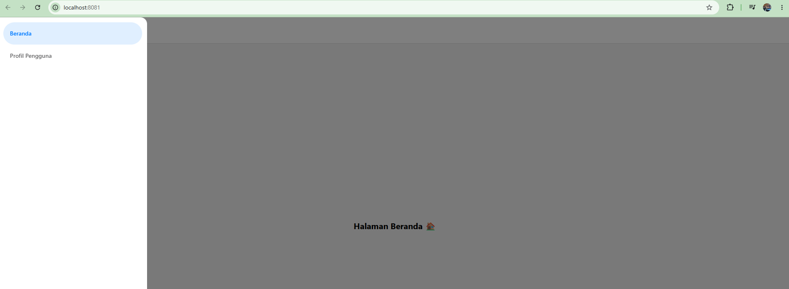

# MODUL PRAKTIKUM 4: Navigasi di React Native

**Mata Kuliah:** Pemrograman Mobile  
**Pertemuan:** 4  
**Nama:** Ibrahim Hilal  
**NIM:** 2488010030  
**Kelas:** IF-C  

---

## A. Tujuan Pembelajaran

Setelah menyelesaikan praktikum ini, mahasiswa diharapkan mampu:
1. Memahami konsep dan mekanisme perpindahan layar (*routing*) pada aplikasi *mobile*.
2. Melakukan instalasi dan konfigurasi pustaka `React Navigation`.
3. Mengimplementasikan **Stack Navigation** untuk alur layar linier.
4. Mengimplementasikan **Tab Navigation** untuk menu pintasan bawah.
5. Mengimplementasikan **Drawer Navigation** untuk menu panel samping.

---

## B. Persiapan Lingkungan (Environment Setup)

Sebelum memulai praktikum, pastikan Anda telah membuat *project* Expo baru. Buka terminal/CMD Anda, dan jalankan perintah instalasi dasar untuk React Navigation:

```bash
# 1. Install core navigation library
npm install @react-navigation/native

# 2. Install dependensi pendukung (wajib untuk Expo)
npx expo install react-native-screens react-native-safe-area-context react-native-gesture-handler react-native-reanimated
```

---

## C. PRAKTIKUM 1: Stack Navigation

Stack Navigation bekerja seperti tumpukan kartu. Layar baru ditumpuk di atas layar lama, dan pengguna dapat kembali ke layar sebelumnya.

### Langkah 1: Instalasi Pustaka Stack

```bash
npm install @react-navigation/native-stack
```

### Langkah 2: Membuat File Layar (Screens)

Buat dua file baru di dalam folder `screens`: `Login.js` dan `Signup.js`.

**File: screens/Login.js**

```javascript
import React from 'react';
import { View, Text, Button, StyleSheet } from 'react-native';

export default function Login({ navigation }) {
  return (
    <View style={styles.container}>
      <Text style={styles.title}>Halaman Login</Text>
      <Button
        title="Belum punya akun? Daftar di sini"
        onPress={() => navigation.navigate('Signup')}
      />
    </View>
  );
}

const styles = StyleSheet.create({
  container: { flex: 1, justifyContent: 'center', alignItems: 'center', backgroundColor: '#f8fafc' },
  title: { fontSize: 24, fontWeight: 'bold', marginBottom: 20 }
});
```

**File: screens/Signup.js**

```javascript
import React from 'react';
import { View, Text, Button, StyleSheet } from 'react-native';

export default function Signup({ navigation }) {
  return (
    <View style={styles.container}>
      <Text style={styles.title}>Halaman Sign Up</Text>
      <Button
        title="Kembali ke Login"
        onPress={() => navigation.goBack()}
      />
    </View>
  );
}

const styles = StyleSheet.create({
  container: { flex: 1, justifyContent: 'center', alignItems: 'center', backgroundColor: '#e0f2fe' },
  title: { fontSize: 24, fontWeight: 'bold', marginBottom: 20 }
});
```

### Langkah 3: Konfigurasi di App.js

```javascript
import React from 'react';
import { NavigationContainer } from '@react-navigation/native';
import { createNativeStackNavigator } from '@react-navigation/native-stack';

import Login from './screens/Login';
import Signup from './screens/Signup';

const Stack = createNativeStackNavigator();

export default function App() {
  return (
    <NavigationContainer>
      <Stack.Navigator initialRouteName="Login">
        <Stack.Screen name="Login" component={Login} options={{ headerShown: false }} />
        <Stack.Screen name="Signup" component={Signup} options={{ title: 'Daftar Akun Baru' }} />
      </Stack.Navigator>
    </NavigationContainer>
  );
}
```

---

## D. PRAKTIKUM 2: Bottom Tab Navigation

Tab Navigation menampilkan menu menetap di bagian bawah layar (seperti aplikasi Instagram/WhatsApp).

### Langkah 1: Instalasi Pustaka Bottom Tabs

```bash
npm install @react-navigation/bottom-tabs
```

### Langkah 2: Membuat Layar Baru

**File: screens/HomeScreen.js**

```javascript
import React from 'react';
import { View, Text } from 'react-native';

export default function HomeScreen() {
  return (
    <View style={{ flex: 1, justifyContent: 'center', alignItems: 'center' }}>
      <Text style={{ fontSize: 20, fontWeight: 'bold' }}>Halaman Beranda 🏠</Text>
    </View>
  );
}
```

**File: screens/ProfileScreen.js**

```javascript
import React from 'react';
import { View, Text } from 'react-native';

export default function ProfileScreen() {
  return (
    <View style={{ flex: 1, justifyContent: 'center', alignItems: 'center' }}>
      <Text style={{ fontSize: 20, fontWeight: 'bold' }}>Halaman Profil 👤</Text>
    </View>
  );
}
```

### Langkah 3: Konfigurasi Tab di App.js

```javascript
import React from 'react';
import { NavigationContainer } from '@react-navigation/native';
import { createBottomTabNavigator } from '@react-navigation/bottom-tabs';

import HomeScreen from './screens/HomeScreen';
import ProfileScreen from './screens/ProfileScreen';

const Tab = createBottomTabNavigator();

export default function App() {
  return (
    <NavigationContainer>
      <Tab.Navigator screenOptions={{ tabBarActiveTintColor: '#0284c7' }}>
        <Tab.Screen name="Home" component={HomeScreen} />
        <Tab.Screen name="Profile" component={ProfileScreen} />
      </Tab.Navigator>
    </NavigationContainer>
  );
}
```

---

## E. PRAKTIKUM 3: Drawer Navigation

Drawer menampilkan panel navigasi samping (*sidebar*) yang dapat digeser atau dibuka melalui ikon Hamburger.

### Langkah 1: Instalasi Pustaka Drawer

```bash
npm install @react-navigation/drawer
```

### Langkah 2: Konfigurasi Drawer di App.js

```javascript
import React from 'react';
import { NavigationContainer } from '@react-navigation/native';
import { createDrawerNavigator } from '@react-navigation/drawer';

import HomeScreen from './screens/HomeScreen';
import ProfileScreen from './screens/ProfileScreen';

const Drawer = createDrawerNavigator();

export default function App() {
  return (
    <NavigationContainer>
      <Drawer.Navigator initialRouteName="Home">
        <Drawer.Screen name="Home" component={HomeScreen} options={{ drawerLabel: 'Beranda' }} />
        <Drawer.Screen name="Profile" component={ProfileScreen} options={{ drawerLabel: 'Profil Pengguna' }} />
      </Drawer.Navigator>
    </NavigationContainer>
  );
}
```

> **Catatan Penting:** Geser layar dari kiri ke kanan pada emulator Anda untuk memunculkan menu Drawer.

---

## F. Tugas Praktikum

Sebagai latihan pemahaman logika *nested navigation* (navigasi bersarang), kerjakan tugas berikut:

Diskusi bersama teman kelompok Anda untuk merancang alur navigasi aplikasi Project Base Test (UTS dan UAS) yang menggabungkan Stack Navigation dan Tab Navigation serta Drawer Navigation.

Kumpulkan kode sumber (dapat di-push ke GitHub) beserta screenshot hasil eksekusi aplikasinya.

---

## G. Hasil Pengujian dan Dokumentasi

Berikut adalah hasil pengujian dan dokumentasi dari masing-masing jenis navigasi yang telah diimplementasikan:

### 1. Stack Navigation (Praktikum 1)

Pada praktikum pertama, diimplementasikan Stack Navigation yang mengatur alur halaman secara linier. Pengguna dapat berpindah dari Halaman Login ke Halaman Sign Up dan kembali ke Halaman Login.

**Halaman Login:**



**Halaman Sign Up:**



### 2. Bottom Tab Navigation (Praktikum 2)

Pada praktikum kedua, diimplementasikan Bottom Tab Navigation yang menampilkan pintasan menu menetap di bagian bawah layar untuk mempermudah navigasi antara Halaman Beranda dan Halaman Profil.



### 3. Drawer Navigation (Praktikum 3)

Pada praktikum ketiga, diimplementasikan Drawer Navigation yang menyediakan menu panel samping (*sidebar*). Panel ini dapat dibuka untuk mengakses Halaman Beranda dan Halaman Profil Pengguna.


